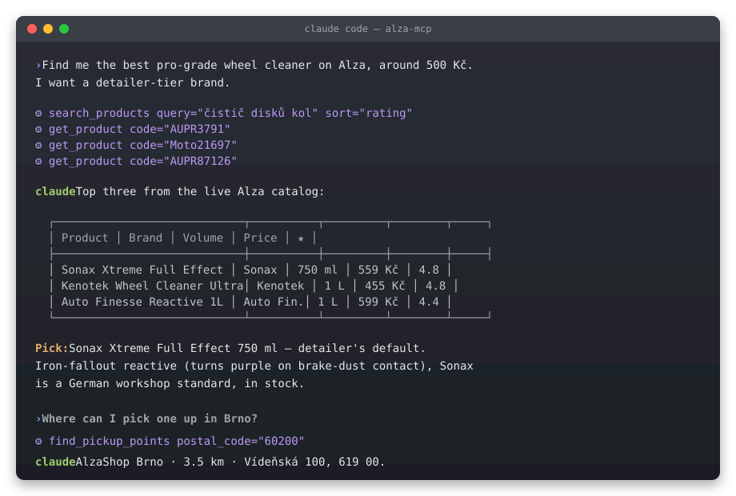

# alza-mcp

> Let your AI agent shop on **[Alza.cz](https://www.alza.cz)** — Central Europe's largest e-commerce store.

[](https://www.npmjs.com/package/alza-mcp)
[](https://github.com/lukabudik/alza-mcp/actions/workflows/ci.yml)
[](LICENSE)
[](https://www.typescriptlang.org/)
[](https://playwright.dev/)
[](https://modelcontextprotocol.io)

`alza-mcp` is an unofficial **Model Context Protocol** server that gives Claude (or any MCP-aware agent) a read-only window into the Alza catalog: search products, pull full detail, read aggregated reviews, find a nearby pickup point. No credentials, no purchases — just research.

<p align="center"></p>

Ask: *"Find me the best pro-grade wheel cleaner under 600 Kč and tell me where I can pick it up in Prague."* The agent calls `search_products` → `get_product` → `find_pickup_points` and gives you a real answer with real prices and a real address.

> [!IMPORTANT]
> This project is **unofficial** — not affiliated with, endorsed by, or sponsored by Alza.cz a.s. It's a community wrapper for personal/research use. Read the [disclaimer](#disclaimer) before deploying or sharing widely.

---

## Quick install

### Claude Code

```bash
claude mcp add alza --scope user -- npx -y alza-mcp
```

That's it. Restart Claude Code, type `/mcp` to confirm, and start asking. First call takes ~30 s while Playwright downloads its headless Chromium browser (~92 MB) — every call after that is a few seconds.

### Claude Desktop

Add to `~/Library/Application Support/Claude/claude_desktop_config.json` (macOS) or `%APPDATA%\Claude\claude_desktop_config.json` (Windows):

```json
{
  "mcpServers": {
    "alza": {
      "command": "npx",
      "args": ["-y", "alza-mcp"]
    }
  }
}
```

Restart the app. Same first-call download.

### Cursor / Continue / any MCP client

Same shape — `command: "npx"`, `args: ["-y", "alza-mcp"]`. Stdio transport, standard MCP everywhere.

---

## What you can ask

A real session captured during testing:

> **You:** Find me the best pro-grade wheel cleaner on Alza, around 500 Kč. I want a detailer-tier brand.
>
> **Claude:** *(calls `search_products` "čistič disků kol" sort=rating, then `get_product` on the top picks)*
>
> Top three from the live catalog:
>
> | # | Product | Brand | Volume | Price | ★ |
> |---|---|---|---:|---:|---:|
> | 1 | Sonax Xtreme Full Effect | Sonax 🇩🇪 | 750 ml | 559 Kč | 4.8 |
> | 2 | Kenotek Wheel Cleaner Ultra | Kenotek 🇧🇪 | 1 L | 455 Kč | 4.8 |
> | 3 | Auto Finesse Reactive 1L | Auto Finesse 🇬🇧 | 1 L | 599 Kč | 4.4 |
>
> Pick: **Sonax Xtreme Full Effect 750 ml** — the de-facto detailer recommendation. It's iron-fallout reactive (turns purple on contact with brake-dust particles so you can watch it work), Sonax is a German workshop standard, and it's in stock.

That's the agent calling four MCP tools across two parallel searches and synthesizing real Alza data. No hallucinated SKUs.

---

## What it does

Five focused tools, all read-only:

| Tool | Purpose |
|---|---|
| **`search_products`** | Keyword search with filters — price range, sort, category, in-stock |
| **`get_product`** | Full detail for one product — price, availability, brand, image, URL |
| **`get_product_reviews`** | Aggregate rating + review count |
| **`find_pickup_points`** | Nearest brick-and-mortar AlzaShop showrooms by postal code |
| **`list_categories`** | 20 top-level Alza categories with ids — feed `category_id` to `search_products` to narrow |

Plus:

- 📦 **Resource** — `alza://product/{code}` lets agents read a product as a URI.
- 💬 **Prompt** — `/find-product` is a guided shopping helper.
- 🌍 **Multi-locale** — works for `alza.cz`, `.sk`, `.hu`, `.at`, `.de`, `.co.uk` via one env var.

---

## Configuration

All optional — `alza-mcp` works out of the box.

| Env var | Default | Purpose |
|---|---|---|
| `ALZA_BASE_URL` | `https://www.alza.cz` | Switch locale: `https://www.alza.cz`, `.sk`, `.hu`, `.at`, `.de`, `.co.uk` |
| `ALZA_CDP_URL` | _unset_ | Connect to your already-running Chrome via CDP instead of launching a managed Chromium. Skips the browser download, inherits your session. Launch Chrome with `--remote-debugging-port=9222` and set `ALZA_CDP_URL=http://localhost:9222`. |
| `ALZA_HEADLESS` | `true` | Set `false` to run a visible browser (debugging only) |
| `ALZA_IDLE_TTL_MS` | `180000` | Close the headless Chromium after this many ms with no tool calls. Lower it on memory-constrained machines; raise it (or disable by setting absurdly high) if you make many calls in quick succession and don't want the relaunch latency. |
| `ALZA_DEBUG` | `false` | Verbose stderr logging |

---

## How it works

Alza has no public consumer API. The mobile app's REST endpoints exist, but Alza runs **Cloudflare Bot Management in challenge mode** — every plain HTTP call returns `403` with a JS challenge. (Most CEE retailers don't do this; e.g. [rohlik-mcp](https://github.com/tomaspavlin/rohlik-mcp) uses plain HTTP because Rohlik runs Cloudflare in passive mode. Alza is one of the few that actively defends its catalog.)

Rather than fight Cloudflare, **`alza-mcp` drives a real browser**:

1. **Playwright + headless Chromium** — Cloudflare lets a real browser through; we just *are* one. No fingerprint games, no proxy dependencies, no cat-and-mouse.
2. **Search** navigates `/search.htm?exps=...` and scrapes `.browsingitem` cards with stable `data-code` attributes.
3. **Product detail** comes from the page's JSON-LD `Product` schema — the same SEO data Google uses for rich snippets. Stable and structured.
4. **Reviews** use the JSON-LD `aggregateRating`.
5. **Pickup points** combine a curated branch dataset with [Nominatim](https://nominatim.openstreetmap.org/) geocoding.
6. **Caching** — search 60 s, product 15 min, categories 24 h. Per-process LRU.

Image, font, and analytics requests are blocked at the route level — every search is one HTML payload, no media. Typical latencies: search ~2 s, product detail ~5 s warm.

```
┌────────────────────────────────────────────┐
│ stdio transport (npx alza-mcp)             │
├────────────────────────────────────────────┤
│ MCP tools / resources / prompts            │
├────────────────────────────────────────────┤
│ Domain: catalog · reviews · pickup         │
├────────────────────────────────────────────┤
│ Infra:                                     │
│  • browser (Playwright, page pool, CDP)    │
│  • jsonld (schema.org parser)              │
│  • cache (LRU + TTL)                       │
│  • locale (multi-country)                  │
└────────────────────────────────────────────┘
```

For deeper architecture notes — including why we don't ship the HTTP/okhttp recipe — see [ARCHITECTURE.md](ARCHITECTURE.md).

---

## Development

```bash
git clone https://github.com/lukabudik/alza-mcp.git
cd alza-mcp
npm install                 # auto-installs Chromium via postinstall
npm test                    # unit tests, no network
npm run typecheck
npm run build               # → dist/
npm run validate:api        # hits real Alza — runs every tool end-to-end
node dist/index.js          # run the server (waits for stdio MCP messages)
```

**Further reading:**
- [ARCHITECTURE.md](ARCHITECTURE.md) — why the code looks the way it does (CF, Playwright, hydration strategy)
- [ROADMAP.md](ROADMAP.md) — what's planned next
- [CONTRIBUTING.md](CONTRIBUTING.md) — repo layout and how to add a tool

---

## Roadmap

The current release is intentionally small and read-only. Highlights of what's planned:

- **AlzaBox locker discovery** — surface 24/7 parcel lockers, not just showrooms
- **Individual review bodies** — load the reviews tab and scrape per-review text, not just the aggregate
- **Streamable HTTP transport** + hosted endpoint on Vercel
- **Compare / recommend / deals** tools
- **PC builder** — socket / RAM / wattage / clearance compatibility engine

Full list and priorities live in [ROADMAP.md](ROADMAP.md).

---

## FAQ

### Why the 92 MB Chromium download?

Cloudflare's Bot Management runs a JavaScript challenge that only a real browser can solve. We tried mimicking the official Alza Android app with `okhttp` and the right cookies (the [topmonks/hlidac-shopu](https://github.com/topmonks/hlidac-shopu/tree/main/actors/alza) recipe) and it works — *if* you call from Apify's residential proxy network. From any laptop or datacenter you get 403s. Driving a real headless Chrome was the only approach that worked end-to-end without external dependencies. See [How it works](#how-it-works) for the full reasoning.

### Why no purchasing / cart / login?

1. **Trust** — running an MCP server that holds your Alza credentials is a much higher bar than a read-only catalog browser.
2. **Stability** — the cart/order flow is the most likely to break with frontend updates.
3. **Scope** — agents that *help you research* are useful even without `place_order`. Click "Buy" yourself when you're ready.

### Can I avoid the Chromium download?

Yes. Set `ALZA_CDP_URL` to your existing Chrome's debug port:

```bash
# launch Chrome with debugging
/Applications/Google\ Chrome.app/Contents/MacOS/Google\ Chrome \
  --remote-debugging-port=9222
# tell alza-mcp to attach
ALZA_CDP_URL=http://localhost:9222 npx alza-mcp
```

The MCP will use *your* Chrome — no separate download, faster cold starts, and it inherits any Alza cookies you already have.

### Will Alza take this down?

The project identifies itself in `User-Agent`, caches aggressively to minimize traffic, has no commercial intent, and provides a takedown contact path via [issues](https://github.com/lukabudik/alza-mcp/issues). If Alza requests removal, we'll comply.

### How does this compare to rohlik-mcp?

[tomaspavlin/rohlik-mcp](https://github.com/tomaspavlin/rohlik-mcp) is the inspiration. Differences:
- Rohlik isn't behind a Cloudflare challenge → rohlik-mcp uses plain HTTP. We're forced to a real browser because Alza is.
- Alza is a much larger catalog (millions of SKUs vs. a grocery list).
- We're read-only by design; rohlik-mcp ships cart actions because the use case is recurring grocery orders.
- We expose MCP **resources** and **prompts** in addition to tools.

---

## Disclaimer

`alza-mcp` is **not affiliated with, endorsed by, or sponsored by Alza.cz a.s.** "Alza", "Alza.cz", and "AlzaBox" are trademarks of their respective owners.

This project drives a real browser to render publicly accessible Alza pages — the same pages a human visitor sees. The maintainers make no guarantees of availability, accuracy, or fitness for any purpose. Use at your own risk; do not rely on this for commercial decisions.

If you are an Alza employee and have concerns, please open an issue or reach out — we will respond promptly.

---

## License

MIT. See [LICENSE](LICENSE).

## Acknowledgements

- [tomaspavlin/rohlik-mcp](https://github.com/tomaspavlin/rohlik-mcp) — direct inspiration; layout patterns we mirror.
- [topmonks/hlidac-shopu](https://github.com/topmonks/hlidac-shopu) — reference Alza scraper recipe (HTTP + proxies).
- [microsoft/playwright-mcp](https://github.com/microsoft/playwright-mcp) — official Playwright MCP, proof that browser-driven MCPs are the right abstraction for many websites.
- [Model Context Protocol](https://modelcontextprotocol.io) and the [TypeScript SDK](https://github.com/modelcontextprotocol/typescript-sdk).
