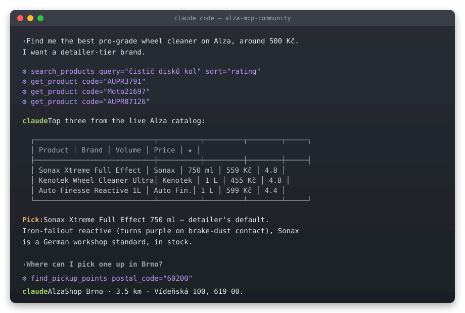

# alza-mcp

> Let your AI agent shop on **[Alza.cz](https://www.alza.cz)** — Central Europe's largest e-commerce store.

[](https://www.npmjs.com/package/alza-mcp)
[](https://github.com/lukabudik/alza-mcp/actions/workflows/ci.yml)
[](LICENSE)
[](https://www.typescriptlang.org/)
[](https://playwright.dev/)
[](https://modelcontextprotocol.io)

`alza-mcp` is an unofficial **Model Context Protocol** server that gives Claude (or any MCP-aware agent) a mobile-API interface to Alza: search products, pull full detail, read reviews, use anonymous/account data, manage a cart, select delivery/AlzaBox pickup, preview checkout, and submit an order only with an explicit one-time confirmation token.

<p align="center"></p>

Ask: *"Find me the best pro-grade wheel cleaner under 600 Kč and tell me where I can pick it up in Prague."* The agent calls `search_products` → `get_product` → `find_pickup_points` and gives you a real answer with real prices and a real address.

> [!IMPORTANT]
> This project is **unofficial** — not affiliated with, endorsed by, or sponsored by Alza.cz a.s. It's a community wrapper for personal/research use. Read the [disclaimer](#disclaimer) before deploying or sharing widely.

---

## Quick install

### Claude Code

```bash
claude mcp add alza --scope user -- npx -y alza-mcp
```

That's it. Restart Claude Code, type `/mcp` to confirm, and start asking. First call takes ~30 s while Playwright downloads its headless Chromium browser (~92 MB) — every call after that is a few seconds.

### Claude Desktop

Add to `~/Library/Application Support/Claude/claude_desktop_config.json` (macOS) or `%APPDATA%\Claude\claude_desktop_config.json` (Windows):

```json
{
  "mcpServers": {
    "alza": {
      "command": "npx",
      "args": ["-y", "alza-mcp"]
    }
  }
}
```

Restart the app. Same first-call download.

### Cursor / Continue / any MCP client

Same shape — `command: "npx"`, `args: ["-y", "alza-mcp"]`. Stdio transport, standard MCP everywhere.

---

## What you can ask

A real session captured during testing:

> **You:** Find me the best pro-grade wheel cleaner on Alza, around 500 Kč. I want a detailer-tier brand.
>
> **Claude:** *(calls `search_products` "čistič disků kol" sort=rating, then `get_product` on the top picks)*
>
> Top three from the live catalog:
>
> | # | Product | Brand | Volume | Price | ★ |
> |---|---|---|---:|---:|---:|
> | 1 | Sonax Xtreme Full Effect | Sonax 🇩🇪 | 750 ml | 559 Kč | 4.8 |
> | 2 | Kenotek Wheel Cleaner Ultra | Kenotek 🇧🇪 | 1 L | 455 Kč | 4.8 |
> | 3 | Auto Finesse Reactive 1L | Auto Finesse 🇬🇧 | 1 L | 599 Kč | 4.4 |
>
> Pick: **Sonax Xtreme Full Effect 750 ml** — the de-facto detailer recommendation. It's iron-fallout reactive (turns purple on contact with brake-dust particles so you can watch it work), Sonax is a German workshop standard, and it's in stock.

That's the agent calling four MCP tools across two parallel searches and synthesizing real Alza data. No hallucinated SKUs.

---

## What it does

With 53 underlying operations, listing every tool on every `tools/list` call would front-load an agent's context with dozens of tools it may never touch in a given conversation. So they're grouped into **toolsets**, and only two are enabled by default:

| Toolset | Enabled by default? | Covers |
|---|---|---|
| `catalog` | ✅ | Search, product detail, reviews, categories, pickup-point lookup |
| `auth` | ✅ | OAuth handshake, account status, the mutation-token issuer |
| `basket_and_checkout` | — | Cart, delivery/pickup selection, checkout, order placement & cancellation |
| `account_management` | — | Profile, contacts, addresses, registration, credential/identity changes |
| `orders_and_payments` | — | Order history, payment methods, after-order payments, claims, documents |
| `reviews_and_subscriptions` | — | Reviews, complaints, AlzaSubscription, attachments, EAN lookup |
| `chat` | — | Alza's in-app chatbot |
| `advanced_raw` | — | `mobile_read`, the untyped escape hatch |

Call **`list_toolsets`** to see every group and **`set_toolset({id, enabled: true})`** to turn one on before using its tools — e.g. enable `basket_and_checkout` before adding something to a cart. This is standard MCP progressive disclosure (`RegisteredTool.enable()`/`.disable()`, which fires the normal `tools/list_changed` notification) — no functionality is removed, it's just not all visible at once.

Catalog tools:

| Tool | Purpose |
|---|---|
| **`search_products`** | Keyword search with filters — price range, sort, category, in-stock |
| **`get_product`** | Full detail for one product — price, availability, brand, image, URL |
| **`get_product_reviews`** | Aggregate rating + review count |
| **`find_pickup_points`** | Nearest brick-and-mortar AlzaShop showrooms by postal code |
| **`list_category_filters`** | Real per-category attribute filters (brand, contrast, panel type, resolution, interfaces, …) with live values/counts — feed the results into `search_products`'s `filters`/`producer_ids` |
| **`list_categories`** | 20 top-level Alza categories with ids — feed `category_id` to `search_products` to narrow |
| **`product_by_ean`** | Looks up catalog products by barcode/EAN (the app's camera barcode-scan API, AT3; read-only, no account required) |

Account and checkout tools:

| Tool | Purpose |
|---|---|
| **`auth_start`** | Creates a mobile-API OAuth PKCE authorization URL |
| **`auth_exchange`** | Exchanges the returned authorization code for mobile-API tokens |
| **`auth_discovery`** | Reads live OIDC metadata from `identity.alza.cz` |
| **`mobile_read`** | Reads fixed APK-confirmed catalog, navigation, account, order-history, list, branch, alternative-product, basket, cost-estimate, web after-payment-dialog, web zip-code (WCF `GetZipCodes` twin), and chatbot-navigation capabilities |
| **`prepare_mutation`** | Creates a one-time token for a fixed, source-confirmed mutation without sending a request |
| **`mutate_list`** | Executes a validated APK-confirmed low-risk mutation (lists, coupons, basket, country/ISIC, gift, watchdog, feedback, discussion) with that token |
| **`account_status`** | Checks whether a mobile API access token is loaded |
| **`cart`** | Reads the current cart and total |
| **`add_to_cart`** | Adds a product by Alza code |
| **`delivery_options`** | Reads delivery + AlzaBox/pickup options from the APK `getDeliveryPaymentGroups` endpoint |
| **`select_pickup_point`** | POSTs the APK `DeliveryPaymentAssociation` payload (taken from the current delivery response) to `getDeliveryAssociations` |
| **`checkout_preview`** | Previews checkout and returns a one-time confirmation token |
| **`place_order`** | Runs the mobile API order sequence only when supplied the preview token and required API payloads |
| **`web_pickup_places`** | Reads the live web pickup family (AlzaBox/branches/24-7 availability, place list, place detail) for web-checkout delivery selection (read-only) |
| **`web_add_to_cart`** | Adds a product to the live web HATEOAS basket (`basket/v1/items`, visitor-keyed) and returns the extracted basket id |
| **`web_cart`** | Reads the live web checkout cart state + item list for a basket id from `web_add_to_cart` (read-only) |
| **`chat_navigation`** | Reads the live chatbot HATEOAS navigation (`chatbotapi.alza.cz`, server-provided chat actions; read-only) |
| **`chat_send`** | Opens/continues a chatbot session with page context (session-scoped, visitor-keyed; returns `{configuration, showChat}`) |

User-management, payments, orders, and post-purchase tools:

| Tool | Purpose |
|---|---|
| **`profile`** | Reads the authenticated profile + address book (APK `getUserData`) |
| **`contacts`** | Reads the account contact list |
| **`register`** | Registers a new Alza account (credential-bearing, one-time token) |
| **`address_upsert`** | Creates/edits a delivery address through the server-provided address form |
| **`address_delete`** | Deletes a delivery address via its per-address action |
| **`address_search`** | Follows the server-provided address-search action (read-only) |
| **`payment_methods`** | Lists payment methods from the APK delivery-payment-group endpoint |
| **`after_order_payments`** | Lists after-order payment options for an order part |
| **`pay_after_order`** | Executes an after-order payment (APK `AfterOrderRequestBody`, one-time token) |
| **`web_place_order`** | Places an order through the live-verified legacy web WCF pipeline (SaveOrder2→3, 113-gate retry, CheckOrder4, SendOrder4; one-time token) — the working submission path while mobile `sendOrder3` 500s |
| **`web_pay_after_order`** | Executes a web after-order payment through the live-verified WCF `CreateAfterPayment` (one-time token) |
| **`order`** | Reads a user order (+ optional part detail, milestones, invoice refs) |
| **`review_submit`** | Submits a product review through the server-provided review form |
| **`complaint_claims`** | Lists warranty claims via the server-provided claims action |
| **`subscription_overview`** | Reads AlzaSubscription overview via the server-provided subscription action |
| **`subscription_activate`** | Activates AlzaSubscription (one-time token) |
| **`subscription_update_installment`** | Changes the installment plan (one-time token) |
| **`upload_attachment`** | Uploads image attachments via the multipart server-provided action (one-time token) |
| **`order_search`** | Searches the account's orders by term (OR6; read-only) |
| **`order_archive`** | Reads the account's archived orders (OR7; read-only; the "Skrýt zrušené" include/hide-cancelled toggle) |
| **`order_document`** | Downloads an order invoice/document from its server-provided href (OR10; origin-validated to the Alza host family) |
| **`gdpr_info`** | Reads the GDPR section + export dialog (A17; read-only — where the data export will be sent) |
| **`claim_detail`** | Reads one warranty claim's detail via its server-provided action (K2; read-only) |
| **`change_password`** | Changes the account password (A14; one-time token; logs the user out of every device) |
| **`two_factor_set`** | Enables/disables SMS two-factor (A15; one-time token) |
| **`phone_change`** | Changes the contact phone number (A16; one-time token) |
| **`email_change`** | Changes the contact email (A16 sibling; one-time token) |
| **`delete_account`** | Deletes the account (A18; one-time token; **irreversible — disposable accounts only**) |

Every high-impact mutation runs only with a one-time token from `prepare_mutation`; the full route inventory, exposure decisions, and verification labels live in [docs/mobile-endpoint-coverage.md](docs/mobile-endpoint-coverage.md).

The MCP never receives or stores the Alza password. OAuth authorization happens outside the MCP; the MCP only exchanges the returned code through the mobile API. No interactive Alza form or browser automation is used by account, cart, delivery, or order tools.

Mobile API environment variables:

| Env var | Purpose |
|---|---|
| `ALZA_API_BASE_URL` | Mobile API base URL, default `https://www.alza.cz` |
| `ALZA_VISITOR_ID` | Optional anonymous visitor UUID; otherwise generated per process |
| `ALZA_OAUTH_AUTHORITY` | OAuth authority, default `https://identity.alza.cz` |
| `ALZA_OAUTH_CLIENT_SECRET` | The `alza_Android` OAuth client is confidential — token requests need its APK-embedded secret (default: the source-verified value; set `""` to omit it for public clients). Used by `auth_exchange` and token refresh |
| `ALZA_CLIENT_SECRET` | Same secret for the PKCE exchange scripts (`scripts/e2e-order-payment.browser.mjs exchange`, `scripts/alza-auth-exchange.mjs`) |
| `ALZA_TOKEN_FILE` | JSON token store written by `scripts/alza-auth-login*` / `scripts/alza_auth_login.py` (default `~/.alza-mcp/tokens.json`; set `none` to disable auto-load) |

Plus:

- 📦 **Resource** — `alza://product/{code}` lets agents read a product as a URI.
- 💬 **Prompt** — `/find-product` is a guided shopping helper.
- 🌍 **Multi-locale** — works for `alza.cz`, `.sk`, `.hu`, `.at`, `.de`, `.co.uk` via one env var.

---

## Configuration

All optional — `alza-mcp` works out of the box.

| Env var | Default | Purpose |
|---|---|---|
| `ALZA_BASE_URL` | `https://www.alza.cz` | Switch locale: `https://www.alza.cz`, `.sk`, `.hu`, `.at`, `.de`, `.co.uk` |
| `ALZA_CDP_URL` | _unset_ | Connect to your already-running Chrome via CDP instead of launching a managed Chromium. Skips the browser download, inherits your session. Launch Chrome with `--remote-debugging-port=9222` and set `ALZA_CDP_URL=http://localhost:9222`. |
| `ALZA_HEADLESS` | `true` | Set `false` for user-controlled login, AlzaBox selection, and payment/MFA prompts |
| `ALZA_IDLE_TTL_MS` | `180000` | Close the headless Chromium after this many ms with no tool calls. Lower it on memory-constrained machines; raise it (or disable by setting absurdly high) if you make many calls in quick succession and don't want the relaunch latency. |
| `ALZA_DEBUG` | `false` | Verbose stderr logging |

---

## Pi agent integration

Register the local build in pi's global MCP config (`~/.pi/agent/mcp.json`):

```json
{
  "alza": {
    "command": "node",
    "args": ["/absolute/path/to/alza-mcp/dist/index.js"]
  }
}
```

Run `/reload` (or `mcp connect alza` — the gateway respawns the stdio process, so a freshly built `dist/` takes effect without `/reload`). The gateway exposes the tools (54 domain tools plus `list_toolsets`/`set_toolset`; only the `catalog` and `auth` toolsets are enabled until you call `set_toolset`) under the `alza_` prefix (`alza_search_products`, `alza_get_product`, `alza_cart`, …). Auth auto-loads from `~/.alza-mcp/tokens.json`. Verified in both modes: (a) in-session through the gateway — search/filter/detail, authenticated add-to-cart, bogus-coupon round-trip → server-side `err:1` envelope ([docs/live-evidence/pi-integration-2026-09-10.md](docs/live-evidence/pi-integration-2026-09-10.md)); and (b) **headless** (`pi -p` one-shot prompt), where the agent discovers the `alza_*` tools, calls `search_products` with the right args, and reports the correct cheapest in-stock product ([docs/live-evidence/headless-pi-2026-09-12.json](docs/live-evidence/headless-pi-2026-09-12.json)); the 2026-09-13 re-run adds three more headless scenarios — catalog search with price-ascending sort, the authenticated account stack (`account_status` + `cart`), and the one-time mutation token flow (`prepare_mutation`) — all captured in [docs/live-evidence/headless-pi-2026-09-13.json](docs/live-evidence/headless-pi-2026-09-13.json).

---

## How it works

Alza has no public consumer API. This project reverse-engineers the Android app's REST surface (route names and DTOs recovered from the APK) and the website's own checkout pipeline. Neither is a supported or documented interface, so any of it can change or break without notice.

**Cloudflare Bot Management.** Alza sits behind it and returns HTTP 403 to plain HTTP clients. This server gets past it in two ways: a headless Chromium (catalog scraping) and a Chrome-fingerprint HTTP sidecar (`scripts/cf-transport.py`, using `curl_cffi` to impersonate Chrome's TLS/HTTP2 fingerprint) for the account/checkout API. That is circumvention of a bot-protection measure, which Alza's terms of use may prohibit. The sidecar is optional and is only present when running from a repo checkout (it is not in the published npm package, which ships `dist/` only); without it the account stack falls back to plain fetch and then the browser. See the [Disclaimer](#disclaimer) and [SECURITY.md](SECURITY.md) before using it.

No generic arbitrary-route tool is exposed. What is and isn't covered:

- Excluded: administrative login routes, telemetry/audit routes, device-token and anonymous-activity routes, and external payment hand-offs (Klarna, Google Pay) plus the quick-order payment family (documented as `blocked` in the coverage matrix).
- Included, behind one-time tokens: order placement and cancellation, account registration, and credential/identity changes (password, 2FA, phone, email, account deletion — `delete_account` is irreversible).
- Server-driven action URLs are followed only when returned by a confirmed response, through the origin-validated `AppActionExecutor` (GET/POST, path allowlist, sensitive-field blocklist, one-time confirmation token); they are not accepted as arbitrary MCP URLs.

The complete 12-family route inventory with method, DTO, prerequisites, side effects, exposure, and verification status is maintained in [docs/mobile-endpoint-coverage.md](docs/mobile-endpoint-coverage.md).

Legacy catalog compatibility still uses the original page adapter:

- Search navigates `/search.htm?exps=...` and scrapes `.browsingitem` cards.
- Product detail comes from page JSON-LD.
- Reviews use JSON-LD aggregate ratings.
- Pickup points combine branch data and geocoding.
- Per-process caching remains enabled.

Image, font, and analytics requests are blocked at the route level — every search is one HTML payload, no media. Typical latencies: search ~2 s, product detail ~5 s warm.

```
┌────────────────────────────────────────────┐
│ stdio transport (npx alza-mcp)             │
├────────────────────────────────────────────┤
│ MCP tools / resources / prompts            │
│  grouped into toolsets (toolsets.ts)       │
├────────────────────────────────────────────┤
│ Domain: catalog · reviews · pickup ·       │
│         mobile-account (cart/checkout/…)   │
├────────────────────────────────────────────┤
│ Infra:                                     │
│  • browser (Playwright, CDP)               │
│  • impersonate-transport (curl_cffi        │
│    Chrome-fingerprint sidecar)             │
│  • mobile-api (APK-derived REST client)    │
│  • jsonld (schema.org parser)              │
│  • cache (LRU + TTL)                       │
│  • locale (multi-country)                  │
└────────────────────────────────────────────┘
```

For deeper architecture notes — including why we don't ship the HTTP/okhttp recipe — see [ARCHITECTURE.md](ARCHITECTURE.md).

---

## Development

```bash
git clone https://github.com/lukabudik/alza-mcp.git
cd alza-mcp
npm install                 # auto-installs Chromium via postinstall
npm test                    # unit tests, no network
npm run typecheck
npm run build               # → dist/
npm run eval                # agent-driven MCP eval harness (6 scenarios) → docs/live-evidence/
npm run validate:api        # hits real Alza — runs every tool end-to-end
npm run pentest:app-action  # Node AppAction transport comparison
npm run live:endpoint-matrix # bounded read-only APK route matrix; requires ALZA_API_BASE_URL
npm run live:user-journeys   # catalog, delivery/cart, and anonymous-account journeys
npm run auth:login:py        # PKCE login step 1 (prints browser URL + pending-login.json)
npm run auth:exchange        # PKCE login step 2 (Node, needs a CF-friendly egress)
node scripts/e2e-order-payment.browser.mjs exchange "<pasted alza://identity redirect>"
                             # step 2 via Playwright (works even when Cloudflare challenges plain HTTP)
npm run live:e2e             # real order + after-order payment through the MCP tools
                             # (browser-backed transport; use ALZA_HEADLESS=false to watch it)
npm run live:e2e:node        # same journey over plain HTTP (in-memory MCP client); needs a
                             # non-challenged egress or a fresh ~/.alza-mcp/tokens.json
STOP_BEFORE_ORDER=1 npm run live:e2e   # dry run: stop right before order submission
ALLOW_ANON=1 npm run live:e2e          # dry run without a logged-in account
node dist/index.js          # run the server (waits for stdio MCP messages)
```

**Further reading:**
- [ARCHITECTURE.md](ARCHITECTURE.md) — why the code looks the way it does (CF, Playwright, hydration strategy)
- [ROADMAP.md](ROADMAP.md) — what's planned next
- [CONTRIBUTING.md](CONTRIBUTING.md) — repo layout and how to add a tool

---

## Roadmap

Highlights of what's planned (the current release already covers catalog, filtering, cart, checkout, order placement/cancellation and account management — see [What it does](#what-it-does) and the known limitations in [docs/gap-analysis.md](docs/gap-analysis.md)):

- **Standalone AlzaBox locker discovery** — today lockers are only reachable through a live cart (`add_to_cart` → `delivery_options` → `web_pickup_places`), because Alza's pickup API is cart-scoped
- **Slider-type attribute filters** (screen size, refresh rate, weight, …) — Alza exposes no discoverable filter API for these; `search_products` only has a name-based screen-size substitute
- **`list_categories` drill-down** — `parent_id` currently returns the top level
- **Individual review bodies** — load the reviews tab and scrape per-review text, not just the aggregate
- **Streamable HTTP transport** + hosted endpoint on Vercel
- **Compare / recommend / deals** tools
- **PC builder** — socket / RAM / wattage / clearance compatibility engine

Full list and priorities live in [ROADMAP.md](ROADMAP.md).

---

## FAQ

### Why the 92 MB Chromium download?

Cloudflare's Bot Management runs a JavaScript challenge that only a real browser can solve. We tried mimicking the official Alza Android app with `okhttp` and the right cookies (the [topmonks/hlidac-shopu](https://github.com/topmonks/hlidac-shopu/tree/main/actors/alza) recipe) and it works — *if* you call from Apify's residential proxy network. From any laptop or datacenter you get 403s. Driving a real headless Chrome was the only approach that worked end-to-end without external dependencies. See [How it works](#how-it-works) for the full reasoning.

### How are login and ordering protected?

1. The Alza login password is never an MCP tool argument — sign-in happens in the user's browser (OAuth PKCE) and the MCP only exchanges the returned code. Tools that necessarily carry credentials as arguments (`register`, `change_password`, `phone_change`, `email_change`) require an explicit one-time token and should only be called with the user's direct instruction.
2. `checkout_preview` creates a one-time confirmation token after the cart and delivery choice are reviewed; `place_order` refuses arbitrary tokens.
3. `web_place_order` (the currently working submission path — mobile `place_order` returns HTTP 500 server-side) and every other high-impact mutation (`cancel_order`, `pay_after_order`, `delete_account`, …) require a one-time token from `prepare_mutation`. Tokens are single-use and bound to one action. MFA and 3-D Secure remain user-controlled browser interactions.
4. These tools create, change and cancel **real orders and accounts**. The token is a guard against accidental calls by an agent, not a substitute for the user confirming the action — have your agent show the order summary and ask first.

### Can I avoid the Chromium download?

Yes. Set `ALZA_CDP_URL` to your existing Chrome's debug port:

```bash
# launch Chrome with debugging
/Applications/Google\ Chrome.app/Contents/MacOS/Google\ Chrome \
  --remote-debugging-port=9222
# tell alza-mcp to attach
ALZA_CDP_URL=http://localhost:9222 npx alza-mcp
```

The MCP will use *your* Chrome — no separate download, faster cold starts, and it inherits any Alza cookies you already have.

### Will Alza take this down?

It might, and you should assume that's possible. The project has no commercial intent, caches to minimize traffic, and provides a takedown contact path via [issues](https://github.com/lukabudik/alza-mcp/issues) — if Alza requests removal, we'll comply. But it does get past Alza's bot protection (see [How it works](#how-it-works)), so it is not a polite scraper by Alza's standards, and Alza's terms of use may forbid it. Use it for personal automation, not at scale.

### How does this compare to rohlik-mcp?

[tomaspavlin/rohlik-mcp](https://github.com/tomaspavlin/rohlik-mcp) is the inspiration. Differences:
- Rohlik isn't behind a Cloudflare challenge → rohlik-mcp uses plain HTTP. We're forced to a real browser because Alza is.
- Alza is a much larger catalog (millions of SKUs vs. a grocery list).
- We cover the whole purchase path (cart, checkout, order placement and cancellation) plus account management, not only catalog reads, and group the tools into toolsets so only the catalog is listed by default.
- We expose MCP **resources** and **prompts** in addition to tools.

---

## Disclaimer

`alza-mcp` is **not affiliated with, endorsed by, or sponsored by Alza.cz a.s.** "Alza", "Alza.cz", and "AlzaBox" are trademarks of their respective owners.

**What this software does.** It is a reverse-engineered client. Its mobile-API routes and data shapes were recovered from the Alza Android application, and its catalog tools scrape alza.cz pages with a headless browser. To reach Alza's servers it circumvents Cloudflare Bot Management (headless Chromium plus a Chrome-fingerprint HTTP sidecar). The Android app's OAuth client credential, which is embedded in the public APK, is used as the default for the token exchange.

**Legal.** None of this is a published or supported interface, and Alza's terms of use may prohibit automated access, bot-protection circumvention and reverse engineering. Whether and how you may use this software depends on your jurisdiction and your agreement with Alza. You are solely responsible for that determination. This is not legal advice, and the maintainers make no representation that use of this software is lawful or permitted.

**It acts on real accounts and spends real money.** The checkout, order, payment, registration and account-deletion tools operate on live Alza accounts. Orders placed are real and binding; cancellation is not guaranteed to succeed. One-time tokens guard against accidental agent calls but are not a substitute for confirming each action yourself. Test only with accounts and orders you are prepared to lose, and never with credentials you are not prepared to expose to your agent's context.

**No warranty.** Provided "as is" under the MIT license. The maintainers make no guarantees of availability, accuracy, or fitness for any purpose, and are not liable for orders, charges, account lockouts or bans resulting from its use. The upstream interfaces can change without notice, so any tool may stop working. Do not rely on this for commercial decisions.

**Security issues** — see [SECURITY.md](SECURITY.md). **Alza employees or rights holders** with concerns: please open an issue or contact the maintainers — we will respond promptly and comply with reasonable removal requests.

---

## License

MIT. See [LICENSE](LICENSE).

## Acknowledgements

- [tomaspavlin/rohlik-mcp](https://github.com/tomaspavlin/rohlik-mcp) — direct inspiration; layout patterns we mirror.
- [topmonks/hlidac-shopu](https://github.com/topmonks/hlidac-shopu) — reference Alza scraper recipe (HTTP + proxies).
- [microsoft/playwright-mcp](https://github.com/microsoft/playwright-mcp) — official Playwright MCP, proof that browser-driven MCPs are the right abstraction for many websites.
- [Model Context Protocol](https://modelcontextprotocol.io) and the [TypeScript SDK](https://github.com/modelcontextprotocol/typescript-sdk).
